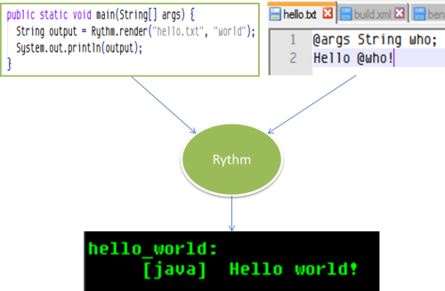

# User Manual

### [introduction]Introduction

Rythm Template Engine is a text generator that merges dynamic content into static template. 



In order to use Rythm to generate a text file, the essential work is to create template file which write down the static part and use Rythm syntax to define the dynamic parts. It is also important to understand that a template file has one or more arguments which is the origin of the dynamic content. The Java program pass parameters to template file via arguments to generate different result.

### [syntax]Rythm Template Syntax

So a template file is a text file, some parts of which have placeholders for dynamically generated content. The template’s dynamic elements are written using the Java language.

Dynamic elements are resolved during template execution. The rendered result is then sent as part of the HTTP response.

The Rythm template syntax is designed to be easy to learn and what you need to understand is one fact:

**The magic `@` character is used to lead all rythm element.**

<div class="alert alert-info"><i class="icon-info-sign"></i> If you want to output a literal <code>@</code> character, you need to double it. E.g.</div>

<iframe data-src="http://fiddle.rythmengine.com/embed/590e5d475704421db16e59b16bb1730a"></iframe>

```lang-html
This is an email address in template: someone@@gmail.com
```

#### [static-content]Static content

All static content (those text not defined in Rythm elements including script blocks) are output literally including whitespace and new lines. 

<div class="alert alert-info"><i class="icon-info-sign"></i> When a template part is executed in compact mode, the additional whitespace and new lines are removed. See <a href="#compact">Compact output</a></div>

#### [comment]Comment

one line comment start with `@//`

```
@// this is one line comment
```

multiple lines comment are put inside `@*` and  `*@` block.

```lang-html
@*
    this is a multiple line comment.
    The text inside this block will be ignore by Rythm template processor
*@
```

#### [expression]Expression

Output expression is the core function of Rythm template, it is used to output dynamic content passed into the template:

```
@user.name @// evaluate user's name property and print it out
@user.getName(), @// call a method on an object and print out the result
```

<div class="alert alert-info"><i class="icon-info-sign"></i> The variable used in an expression could be either a declared template argument or a variable declared in a script block. </div>

The bracket “( )” can be used to compose complicated expressions or to separate an expression from other part of the template:

```
@(1 + 5) @// print out the result of 1 + 5

@// use ( ) to separate expression from other part of the template
@(user.name)_and_some_other_string 
```

See also 
* [Escape expression result](#escape), 
* [Null safe expression](#null-safe), 
* [Transform expression output](#transformer)

### [more-about-expression]More about expression

#### [escape]Escape expression result

Expression result is escaped before output depending on the current context to avoid injection attack. For example

```lang-html
<input value="@name">
```

Suppose `name` value is "`" onload="alert('Hack')`", if the output of `@name` is not escaped, the result will be:

```lang-html
<input value="" onload="alert('Hack')">
``` 

Which is definitely not the template author wanted. If the expression output is escaped using `html` scheme, then the result will be:

```lang-html
<input value="&quot; onload=&quot;alert(&apos;Hack&apos;)">
``` 

Not in good look but avoid the html injection attack. Escape also solves a common problem of processing user input which contains special characters, e.g. for template

```lang-html
<script>
alert("@product.name")
</script> 
```

If the product name contains "`"`", then it will cause the javascript error at runtime. If the output is properly escaped, the issue will be addressed.

Not all template engine on the market address the expression escape issue properly, some of them even don't have a default escape scheme and require the template author to manually escape the expression. 

Rythm, on the contrary, provides the state-of-art support on expression escape. Take a look at this example:

```lang-html
<html>
...
<p>@description</p>
...
<script>
alert("@description")
</script>
```

Suppose `description` is "`<h1>abc"xyz</h1>`", Rythm will generate:

```lang-html
<html>
...
<p>&lt;h1&gt;abc&quot;xyz&lt;/h1&gt;</p>
...
<script>
alert("<h1>abc\"xyz<\/h1>")
</script>
```

The above example shows clearly that Rythm use different escape scheme in different context (html and javascript). So here is what Rythm did, the initial escape context is set to `html`, when Rythm encountered "`<script>`" it switch the escape context to `Javascript` until it reaches "`</script>`" and then switch back to `html`.

See also [Set initial code type](#set-init-code-type) 

<div class="alert alert-info">
    <i class="icon-info-sign"></i>
    You can force Rythm to use a specific scheme to escape an expression by using the escape 
    <a href="transformer">transformer</a>
</div>

#### Null safe expression

When output an expression a common concern is how to deal with `null` values. It is not unusual that we expect it output empty string `""` when `null` value is expected. Which might result in verbose code for a simple expression like `@foo.bar.zee`:

```
@if(null != foo && null != bar) {@foo.bar.zee}
```

Fortunately, Rythm provides a feature called "null safe expression", which allows you to use `?` to create null safe expression. And the above code could be simplified as:

```
@foo?.bar?.zee
```

The above expression will not throw out `NullPointerException` if `foo` or `foo.bar` is `null`.

<div class="alert alert-error"><i class="icon-warning-sign"></i> You cannot use null safe expression in parameters like <code>@foo?.bar(@x?.y)</code></div>

#### [elvis]Elvis expression

In some special case, template author might want to output default value if `null` is found in an expression, and Rythm provides "elvis" operator in expression to handle that case:

```
@(foo ?: "not present")
```  

The above code will output "not present" if variable `foo` is `null`.

<div class="alert alert-error"><i class="icon-warning-sign"></i> You cannot mix use null safe expression and elvis operation like <code>@(foo?.bar ?: "not present")</code></div>

#### [transformer]Transform expression output

Sometimes it needs some kind of transform operations to precess expression output. A typical example is to format a `Date` typed variable:

```
@dueDate.format("yyyy-MM-dd")
```

Here the `format` is called transformer, which accept a Date type object and format(transform) it using specified format pattern. 

One or more Transformer could be applied to an expression to provide further processing. For example

```
@foo
```