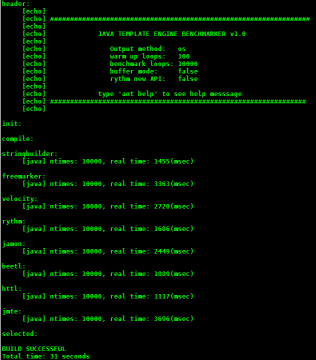

# 功能特性

Rythm为Java程序员提供了一个简洁易用的高性能通用型模板引擎解决方案。

### [developer-friendly]面对开发人员

Rythm是程序员为程序员设计的，易用性是Rythm的第一关注点。从API到模版语法，简洁优雅在Rythm中无处不在。用代码说话，让我们看看Rythm的模版语法先：

```lang-html,fid-cc5533f277d64ed69678738f97b91227
@// 一条行注释

@**
 * 可以穿越多行的 
 * 块注释在此留痕
 *@

@// 在此申明模版中需要用到的变量
@args List<Order> orders, int maxLines, User user

<h1>订单管理</h1>

@ifNot (user.hasRole("order-manager")) {
    <p>抱歉，您无权访问该网页</p>
    @return @// 使用@return来中断模版执行并返回
}

<div id="order-list">
@for(Order order : orders) {
    @if(order_index >= maxLines) {
        <a href="#" id="load-more">点此加载更多订单...</a>
        @break @// 达到最大行之后中断循环
    }
    @**
     * 用到的循环变量: 
     * _parity: 依据当前循环计数交替为"odd"或"even"
     * _isFirst: 第一次循环为true
     * _isLast: 最后一次循环为true
     *@
    <div class='order @order_parity @(order_isFirst ? "first" : "") @(order_isLast ? "last" : "")'>
        <h3>@order.getName()</h3>
        @if (order.closed()) {
            <div>订单已经关闭</code>
        } else {
            <div>...</div>
        }
    </div>
} else {
    @// 集合为空时执行for循环的else块
    <div class="alert alert-info">没有找到订单</a>
}
</div>
```

显而易见Rythm使用一个特殊的 `@` 符号来引导语法元素，包括注释，流程控制，输出变量值等。这个思想最初出自.Net的[Razor](http://weblogs.asp.net/scottgu/archive/2010/07/02/introducing-razor.aspx)引擎。必须说明开发Rythm的灵感也正是由Razor优雅的设计所激发。

除了Razor式的语法，Rythm设计的另一个原则是其语法应当让Java程序员感到亲切。简言之，一个有经验的Java程序员在从未学习过Rythm的情况下应该能毫不费力的阅读Rythm模版代码，并能在几分钟之内开始写作。

下面再来看看在Java程序中如何通过调用Rythm API：

```java
// 内联模版直接传入模版内容
String s = Rythm.render("Hello @who", "world");

// 文件模版使用同样的API，但是传入文件名
String s = Rythm.render("hello.txt", "world");

// 按照模版变量申明位置传入参数
String s = Rythm.render("Hello @1", "world");

// 按照模版变量名传入参数
Map<String, Object> params = new HashMap<String, Object>();
params.put("who", "world");
String s = Rythm.render("Hello @who", params);

// 也是按照模版变量名传递参数，不过有点炫
NamedParams np = NamedParams.instance;
String s = Rythm.render("hello @who", np.from(np.pair("who", "world")));
```

大道至简，Rythm的API用同样的方法来承载不同的方式而依然清澈透明。这是贯穿Rythm设计的又一原则。

### [high-performance]高性能

和常见的[Velocity](http://velocity.apache.org/)以及[FreeMarker](http://freemarker.sourceforge.net/)之类的动态类型引擎不同，Rythm是静态类型的，并且直接编译为Java字节码，因此获得高性能。据[此性能测试程序](https://github.com/greenlaw110/template-engine-benchmarks)，Rythm在性能方面是Java模版引擎中的佼佼者：



### [general-purpose]通用性

Rythm被设计为通用模版引擎，可以生成html页面，xml文件，各种源代码，SQL脚本，电子邮件以及任何**基于文本的内容**。另一方面，Rythm可在任何java程序中使用，而不依赖某一个特定的框架。

### [auto-reload]自动重载

Rythm可以选择两种不同的模式来运行：**prod**(产品) 和 **dev**(开发)。

在开发模式下，如果模板文件被修改了，则rythm会自动重新解析、编译并把它载入到classloader中。对于单个文件来讲，该过程非常迅速，你几乎不会注意到延时。

Rythm在产品模式下关闭了自动重载以获取最高性能。

### [extensibility]重用和扩展

Rythm提供了各种方法帮助用户重用和扩展他们的模版库，包括：

* **模版调用**: 这是最常用的也是最强大扩充模版库的办法。Rythm允许用户在模版中把另一个模板当作一个java方法来调用。例如你打算在当前模版中调用另一个模版文件 `${tmpl_home}/bar/foo.html`，可以简单地写下： 

    ```java
    @bar.foo()
    ``` 

    如果 `foo.html` 模版中申明了模版参数：

    ```java
    @args String user, int age
    ...
    ```
    
    那你可以按下述方式来传递参数变量：
    
    ```java
    // 按照位置传递参数
    @bar.foo("Rythm", 1)
    
    // 按照名字传递参数
    @bar.foo(user: "Rythm", age: 1)
    
    // 用JavaScript的样式传递参数：
    @bar.foo({
        user: "Rythm",
        age: 1
    })
    ```
     
* **内联方法**: 在模版中定义内联方法就如同定义一个Java方法一样简单
* **宏**: 宏在解析时被处理，这是运行时最快的重用模版块的方法，但不能传递参数。
* **Include指令**: 在当前位置插入另一个模版的内容。可以重用被插入模版的内联行数。 
* **变换器**: 输出Java变量结果时对其进行再处理，使用起来就像调用被处理变量的方法一样。

### [security]安全

Rythm默认以无限制方式运行模版。在通常的场景下，模版的内容由项目管控，这种方式没有任何危险。但在某些场景下，需要接受用户输入的模版代码的情况下，就必须保证用户模版代码不会让你的运行环境挂掉（比如一个有 `@{System.exit(1)}` 的模版代码）。

Rythm为这种情况提供了一个名为“替换模式”的运行环境。这种方式可以完全避免由于运行不信任模版代码带来的担忧，因为该模式仅仅运行变量值替换，而所有可能带来不安全因素的特性都被屏蔽了，其中包括 _表达式运算_, _脚本_ 和 _自由循环_ 等。运行“替换模式”的API是：

```java
String s = Rythm.substitute(unTrustedTemplate, ...)
```

如果一定要在非信任模版上运行“替换模式”范围之外的特性，Rythm提供了“沙箱模式”来保证系统安全。在“沙箱模式下”如果模版中出现不安全类调用的时候，Rythm会触发`java.lang.SecurityException`，以防止恶意代码攻击，同时沙箱模式会检查运行时间，如果模版运行超时，则触发`java.util.concurrent.TimeoutException`，以防止无限循环。使用沙箱模式的API是：

```java
String s = Rythm.sandbox().render(unTrustedTemplate, ...);
```

注意在沙箱模式下rythm的执行速度会降低约40%。    
    
### [i18n]国际化与本地化

再也没有比Rythm更简单的国际化与本地化支持了：

```java
<h1>@i18n("main.title")</h1>
...
<p>@i18n("template", "planet", 7, new Date())</p>
```

依照不同的区域设置可以生成

```html
<h1>Top News</h1>
...
<p>At 3:53 PM on 11 March 2013, we detected 7 spaceships on the planet Mars</p>
```

或者

```html
<h1>头条新闻</h1>
<p>我们于2013年3月11日的下午3:53在火星上发现了7艘宇宙飞船</p>
```

下面再来看看本地化的例子

```java
@args Date date, Double amount
@i18n("date"): @date.format()
@i18n("amount"): @amount.formatCurrency()
```

依照不同的区域设置，上述模版生成 

```
Date: 11 March 2013
Amount: $20000.00
```

或者

```
日期：2013年3月11日
金额：￥20000.00
```

很简洁，不是吗？

### [rich-function]丰富的特性

Rythm还提供一系列丰富的特性，包括

* 布局管理
* 转换器
* 缓存
* 自然模版
* 智能转码
* ... 

点击[文档中心](index.md)查看更多信息
